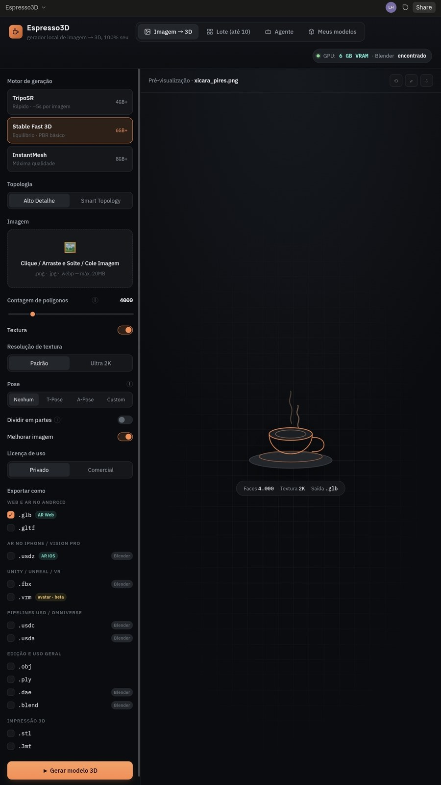

<p align="center">
  
</p>

<h1 align="center">Espresso 3D</h1>

<p align="center">
  
  
  <br>
  
  
  
</p>

---

<p align="center">
  
  
  
  
  
  
</p>

Gerador de modelos 3D a partir de imagens, rodando **na sua máquina**, com
modelos de código aberto. Sem assinatura, sem créditos, sem enviar suas
imagens para servidor nenhum.


## Interface

<p align="left">
  
</p>

**[Ver as telas →](https://lianeheidemann.github.io/espresso-3d/)** *(prévia navegável;
a geração 3D roda localmente)*

---

## O que ele faz

- **Imagem → 3D** com escolha de motor, contagem de polígonos, textura e PBR
- **Lote de até 10 imagens**, todas com as mesmas configurações
- **Dividir em partes**: uma foto de xícara com pires vira dois objetos separados
- **Pose e esqueleto** para personagens — T-Pose, A-Pose ou descrita em texto
- **Exportação para AR/VR**: `.glb`, `.usdz`, `.fbx`, `.vrm`, `.usdc` e mais
- **Agente**: peça em português ("gera essa xícara separada do pires, em fbx")
- **Biblioteca** dos modelos gerados, com exclusão para a lixeira

---

## Instalação

```bash
git clone https://github.com/lianeheidemann/espresso-3d.git
cd espresso-3d
python -m venv .venv && source .venv/bin/activate    # Windows: .venv\Scripts\activate
pip install -r requirements.txt
pip install -e .          # registra o pacote (layout src/)
python -m espresso3d
```

Abre em `http://localhost:7860`.

Isso já dá a interface completa, o pós-processamento de malha, a exportação
para os formatos leves e a biblioteca. **Para gerar 3D de verdade**, instale
pelo menos um motor abaixo.

### Motores de geração 3D

Precisam do PyTorch com CUDA. Instale o que couber na sua GPU:

| Motor | VRAM | Licença dos pesos | Uso comercial | PBR | Como instalar |
|---|---|---|---|---|---|
| **TripoSR** | 4 GB+ | MIT | ✅ | ➖ | `pip install git+https://github.com/VAST-AI-Research/TripoSR.git` |
| **Stable Fast 3D** | 6 GB+ | Stability AI Community | ⚠️ ¹ | ✅ | `pip install git+https://github.com/Stability-AI/stable-fast-3d.git` |
| **InstantMesh** | 8 GB+ | Apache 2.0 | ✅ | ✅ | `git clone https://github.com/TencentARC/InstantMesh && pip install -r InstantMesh/requirements.txt` |

¹ A licença da Stability é gratuita para uso pessoal e para empresas com
receita anual abaixo de US$ 1M. Escolhendo **Licença: Comercial** na
interface, o app esconde os motores que não se encaixam.

Os pesos são baixados do Hugging Face na primeira geração (alguns GB) e
ficam em cache — não vão para o Git.

### Recursos opcionais

| Recurso | O que instalar | Sem isso |
|---|---|---|
| `.fbx` `.usdz` `.usdc` `.dae` `.blend` | [Blender](https://www.blender.org/download/) (grátis) | Só saem os formatos leves; a interface avisa |
| `.vrm` (avatar VR) | Blender + addon VRM | Formato indisponível |
| Dividir em partes | `pip install segment-anything` + checkpoint `vit_b` em `checkpoints/` | Gera o objeto inteiro |
| Melhorar imagem | `pip install realesrgan basicsr` | Usa reamostragem simples |
| Aba Agente | [Ollama](https://ollama.com) + `ollama pull gemma3:4b` | Modo básico por palavras-chave |
| Pose e esqueleto | [UniRig](https://github.com/VAST-AI-Research/UniRig) | Pose fica indisponível |
| Pose por foto | `pip install mediapipe` | Só pose por texto |

Se o Blender não estiver no PATH, aponte: `export BLENDER_BIN=/caminho/blender`.

---

## Formatos de exportação

Agrupados por onde você vai usar o modelo:

| Grupo | Formatos | Precisa Blender | Carrega rig | Carrega textura |
|---|---|---|---|---|
| Web e AR no Android | `.glb` `.gltf` | não | ✅ | ✅ |
| AR no iPhone / Vision Pro | `.usdz` | sim | ✅ | ✅ |
| Pipelines USD / Omniverse | `.usdc` `.usda` | sim | ✅ | ✅ |
| Unity / Unreal / VR | `.fbx` | sim | ✅ | ✅ |
| Avatares VR | `.vrm` | sim + addon | ✅ | ✅ |
| Edição e uso geral | `.obj` `.ply` `.dae` `.blend` | parcial | parcial | parcial |
| Impressão 3D | `.stl` `.3mf` | não | ❌ | `.stl` não |

A interface avisa antes de exportar quando o formato escolhido descarta
textura ou esqueleto. `.obj` sai zipado junto com o `.mtl` e as texturas.

---

## Onde ficam os modelos gerados

Uma pasta por geração, dentro de `outputs/`:

```
outputs/2026-09-05_143012_xicara_pires/
├── xicara_pires.glb        # os formatos que você escolheu
├── xicara_pires.fbx
├── source.png              # a imagem original
└── meta.json               # motor, polígonos, pose, licença, duração
```

**Não há banco de dados.** A biblioteca é montada varrendo `outputs/*/meta.json`,
então você pode mover, copiar ou fazer backup da pasta à vontade — e apagar
um modelo é só remover a pasta dele, sem deixar arquivo órfão.

Apagar pela interface manda para a **lixeira do sistema** por padrão
(recuperável); a exclusão permanente é uma opção explícita.

---

## Agente

Escolha o cérebro na aba Agente. Todos são gratuitos:

| Modelo | Download | Onde cabe | Enxerga imagem |
|---|---|---|---|
| Gemma 3 4B | 3,3 GB | qualquer GPU, ou CPU | ✅ |
| Qwen 2.5 3B | 2,0 GB | qualquer GPU, ou CPU | ❌ |
| Qwen 2.5 7B | 4,7 GB | 8 GB VRAM, ou CPU | ❌ |
| Llama 3.1 8B | 4,9 GB | 8 GB VRAM, ou CPU | ❌ |
| Mistral 7B | 4,4 GB | 6 GB VRAM, ou CPU | ❌ |
| Moondream 2B | 1,7 GB | qualquer GPU, ou CPU | ✅ |
| Groq / OpenRouter | — | nuvem, precisa de chave | ❌ |
| Modo básico | — | palavras-chave, sem LLM | ❌ |

**Deixe "Rodar na CPU" ligado** se sua GPU tiver 8 GB ou menos: o agente só
precisa montar um JSON pequeno, e assim a VRAM inteira fica para o gerador 3D.

O agente **nunca gera nada sozinho** — ele monta a configuração, mostra o
card de confirmação e espera você aprovar.

---

## Limitações honestas

- **Rig automático é melhor esforço**: funciona bem em humanoide claro, pode
  falhar em formas estilizadas. A interface avisa em vez de entregar algo torto.
- **PBR depende do motor** — TripoSR não gera mapas de metalness/roughness.
- **Lote roda uma imagem por vez**: com 4-8 GB de VRAM, paralelizar faz as
  duas gerações falharem.
- **Qualidade não é a do Meshy pago.** Os modelos abertos chegam perto, mas
  não empatam com pipelines proprietários treinados em datasets fechados.
- **Pose por texto é aproximada**: acerta "sentado, braços cruzados", não o
  ângulo exato do cotovelo. Para precisão, use a foto de referência.

---

## Desenvolvimento

```bash
python -m pytest tests/ -q
```

Os testes cobrem a lógica que não precisa de GPU: validação de configuração,
redução de malha, exportação, interpretação de pedidos do agente, validação
das rotações de pose e a biblioteca de modelos.

```
espresso-3d/
├── README.md · LICENSE · assets/ · docs/    # ficam na raiz
├── requirements.txt · pyproject.toml
├── tests/
└── src/
    └── espresso3d/        # todo o código fica aqui dentro
        ├── __main__.py    # entrypoint: python -m espresso3d
        ├── config.py      # PipelineConfig: tudo que o usuário escolhe
        ├── hardware.py    # detecta GPU, Blender e Ollama
        ├── engines/       # motores de geração 3D (registro plugável)
        ├── pipeline/      # melhoria → segmentação → geração → malha → rig → exportação
        ├── agent/         # cérebros do agente + interpretação de pedidos
        ├── library/       # biblioteca dos modelos gerados
        └── ui/            # as quatro abas em Gradio
```

O layout `src/` é a convenção do Python para separar o código do resto do
repositório. `pytest` roda direto da raiz (o `pyproject.toml` cuida do
caminho); para usar `python -m espresso3d` de qualquer pasta, o
`pip install -e .` da instalação já resolve.

Para adicionar um motor: crie o módulo em `src/espresso3d/engines/`, herde de `Motor` e
acrescente uma linha em `MOTORES`. A interface se atualiza sozinha.

## Licença

Código sob [MIT](LICENSE). Os modelos de IA têm licenças próprias — confira
a tabela de motores antes de usar um resultado comercialmente.
