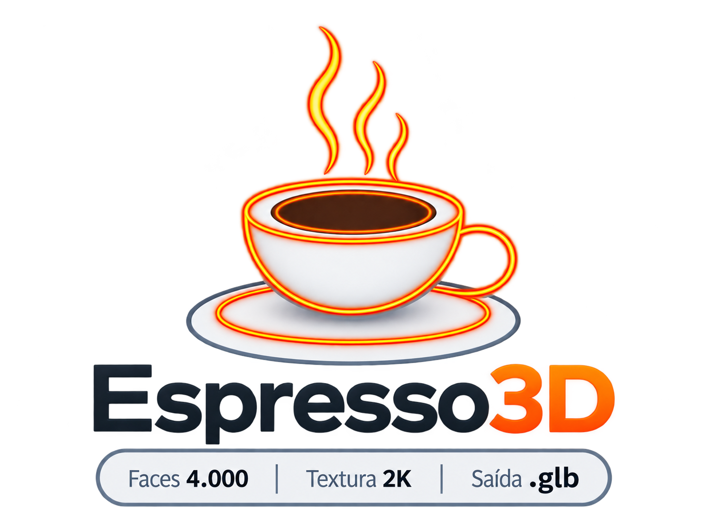
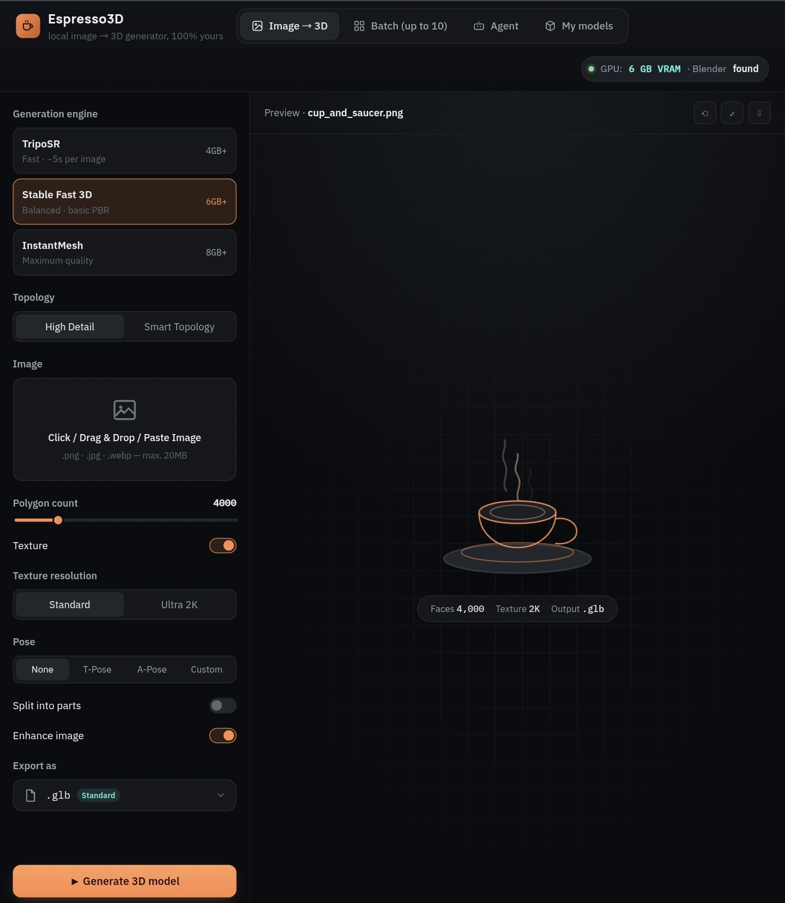
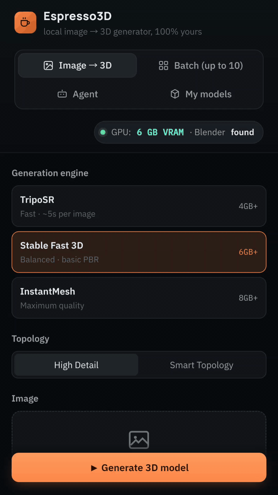

<p align="center">
  <picture>
    <source media="(prefers-color-scheme: dark)" srcset="assets/logo-dark.png">
    <source media="(prefers-color-scheme: light)" srcset="assets/logo-light.png">
    
  </picture>
</p>

---

<p align="center">
   
</p>

<p align="center"><em>Turn a photo into a 3D model — on your own machine, with open-source models.</em></p>

<p align="center">
  
  
  <a href="LICENSE"></a>
</p>

<p align="center">
  <a href="https://github.com/lianeheidemann/espresso-3d/actions/workflows/pages/pages-build-deployment">
    
  </a>
</p>

Espresso3D is a self-hosted image-to-3D generator. It runs entirely on your
own hardware using open-source models — no subscription, no credit system,
and your images never leave your machine.

## Interface

**Web**

<p align="left">
  
</p>

**Mobile**



**[Live UI preview →](https://lianeheidemann.github.io/espresso-3d/)** *(interactive
mockup of the screens, responsive on mobile; 3D generation itself runs locally)*

---

## Features

| | |
|---|---|
| **Image → 3D** | Choose the engine, target polygon count, texture resolution and PBR output |
| **Batch processing** | Up to 10 images per run, all sharing the same configuration |
| **Part splitting** | A photo of a cup and saucer produces two separate objects instead of one fused mesh |
| **Rigging and posing** | T-Pose, A-Pose, or a pose described in plain language |
| **AR/VR export** | `.glb`, `.usdz`, `.fbx`, `.vrm`, `.usdc` and more, grouped by target platform |
| **Natural-language agent** | Describe what you want; review the parsed configuration before it runs |
| **Model library** | Browse, search and delete generated models, with safe deletion to the system trash |

---

## Quick start

**Requirements:** Python 3.10 or newer. An NVIDIA GPU is required for 3D
generation, but not to explore the interface.

```bash
git clone https://github.com/lianeheidemann/espresso-3d.git
cd espresso-3d
python -m venv .venv && source .venv/bin/activate    # Windows: .venv\Scripts\activate
pip install -r requirements.txt
pip install -e .
python -m espresso3d
```

The interface opens at `http://localhost:7860`.

This gives you the full UI, mesh post-processing, export to the lightweight
formats, and the model library. **To actually generate 3D models**, install
PyTorch with CUDA and at least one engine below.

> **Step-by-step setup guide:** [`docs/SETUP.md`](docs/SETUP.md) — installation
> order, per-component verification, and the common failure modes.

### 3D generation engines

All engines require PyTorch with CUDA. Install whichever fits your GPU:

| Engine | VRAM | Weights license | Commercial use | PBR | Installation |
|---|---|---|---|---|---|
| **TripoSR** | 4 GB+ | MIT | Yes | — | `pip install git+https://github.com/VAST-AI-Research/TripoSR.git` |
| **Stable Fast 3D** | 6 GB+ | Stability AI Community | Conditional ¹ | Yes | `pip install git+https://github.com/Stability-AI/stable-fast-3d.git` |
| **InstantMesh** | 8 GB+ | Apache 2.0 | Yes | Yes | `git clone https://github.com/TencentARC/InstantMesh && pip install -r InstantMesh/requirements.txt` |

¹ The Stability AI Community License is free for personal use and for
organizations under USD 1M in annual revenue. Selecting **License: Commercial**
in the interface hides engines that do not qualify.

Model weights are downloaded from Hugging Face on first use (several GB) and
cached locally. They are excluded from version control.

### Optional components

| Feature | Requirement | Behavior without it |
|---|---|---|
| `.fbx` `.usdz` `.usdc` `.dae` `.blend` export | [Blender](https://www.blender.org/download/) | Only the lightweight formats are offered; the UI explains why |
| `.vrm` avatar export | Blender + VRM add-on | Format unavailable |
| Part splitting | `pip install segment-anything` + `vit_b` checkpoint in `checkpoints/` | Generates the object as a single mesh |
| Image enhancement | `pip install realesrgan basicsr` | Falls back to Lanczos resampling |
| Agent tab | [Ollama](https://ollama.com) + `ollama pull gemma3:4b` | Falls back to keyword parsing |
| Rigging and pose | [UniRig](https://github.com/VAST-AI-Research/UniRig) | Pose options disabled |
| Pose from reference photo | `pip install mediapipe` | Text-described poses only |

If Blender is not on your `PATH`, point to it explicitly:
`export BLENDER_BIN=/path/to/blender`.

---

## Export formats

Formats are grouped by where the model is going, not alphabetically:

| Group | Formats | Needs Blender | Carries rig | Carries texture |
|---|---|---|---|---|
| Web and Android AR | `.glb` `.gltf` | No | Yes | Yes |
| iOS / Vision Pro AR | `.usdz` | Yes | Yes | Yes |
| USD / Omniverse pipelines | `.usdc` `.usda` | Yes | Yes | Yes |
| Unity / Unreal / VR | `.fbx` | Yes | Yes | Yes |
| VR avatars | `.vrm` | Yes + add-on | Yes | Yes |
| General editing | `.obj` `.ply` `.dae` `.blend` | Partial | Partial | Partial |
| 3D printing | `.stl` `.3mf` | No | No | `.stl` no |

The interface warns before exporting whenever the selected format discards
texture or skeleton data. `.obj` is delivered zipped alongside its `.mtl` and
texture files.

---

## Output structure

Each generation creates a self-contained folder under `outputs/`:

```
outputs/2026-09-05_143012_cup_and_saucer/
├── cup_and_saucer.glb      # the formats you selected
├── cup_and_saucer.fbx
├── source.png              # the original input image
└── meta.json               # engine, polygon count, pose, license, duration
```

**There is no database.** The library is built by scanning
`outputs/*/meta.json`, which means you can move, copy or back up the folder
freely, and deleting a model is simply removing its directory — no orphaned
files and no index to fall out of sync.

Deleting through the interface sends the folder to the **system trash** by
default; permanent deletion is an explicit opt-in.

---

## Agent

The agent translates a plain-language request into a pipeline configuration.
Pick its backend in the Agent tab — all options are free:

| Backend | Download | Runs on | Vision |
|---|---|---|---|
| Gemma 3 4B | 3.3 GB | Any GPU, or CPU | Yes |
| Qwen 2.5 3B | 2.0 GB | Any GPU, or CPU | No |
| Qwen 2.5 7B | 4.7 GB | 8 GB VRAM, or CPU | No |
| Llama 3.1 8B | 4.9 GB | 8 GB VRAM, or CPU | No |
| Mistral 7B | 4.4 GB | 6 GB VRAM, or CPU | No |
| Moondream 2B | 1.7 GB | Any GPU, or CPU | Yes |
| Groq / OpenRouter | — | Cloud, API key required | No |
| Keyword mode | — | No LLM at all | No |

**Keep "Run on CPU" enabled** if your GPU has 8 GB or less. The agent only has
to produce a small JSON object, so leaving it on the CPU keeps the entire VRAM
budget available for 3D generation.

The agent **never generates anything on its own** — it builds the
configuration, presents it for confirmation, and waits for approval.

---

## Known limitations

These are stated up front rather than discovered later:

- **Automatic rigging is best-effort.** It works well on clearly humanoid
  characters and can fail on stylized shapes. The interface reports the
  failure instead of producing a broken skeleton.
- **PBR support depends on the engine.** TripoSR does not produce
  metalness/roughness maps.
- **Batch runs are sequential.** With 4–8 GB of VRAM, running generations in
  parallel causes both to fail.
- **Output quality does not match commercial services.** Open models come
  close, but not to pipelines trained on proprietary datasets.
- **Text-described poses are approximate.** They capture "seated, arms
  crossed" reliably, not a specific elbow angle. Use a reference photo when
  precision matters.

---

## Development

```bash
python -m pytest -q
```

The test suite covers the logic that does not require a GPU: configuration
validation, mesh decimation, export routing, agent request parsing, pose
rotation validation, and the model library.

```
espresso-3d/
├── README.md · LICENSE · assets/ · docs/ · mockup/
├── requirements.txt · pyproject.toml
├── tests/
└── src/
    └── espresso3d/
        ├── __main__.py    # entry point: python -m espresso3d
        ├── config.py      # PipelineConfig — every user-facing option
        ├── hardware.py    # GPU, Blender and Ollama detection
        ├── engines/       # 3D generation engines (pluggable registry)
        ├── pipeline/      # enhance → segment → generate → mesh → rig → export
        ├── agent/         # agent backends and request parsing
        ├── library/       # generated model library
        └── ui/            # the four Gradio tabs
```

The `src/` layout is the standard Python convention for separating package
code from repository metadata. `pytest` runs from the repository root
(`pyproject.toml` handles the path); `pip install -e .` makes
`python -m espresso3d` work from any directory.

**Adding an engine:** create a module under `src/espresso3d/engines/`, subclass
`Motor`, and register it in `MOTORES`. The interface picks it up automatically.

---

## License

The Espresso3D source code is released under the [MIT License](LICENSE).

The AI models it integrates carry their own licenses — review the engine table
above before using generated assets commercially.
